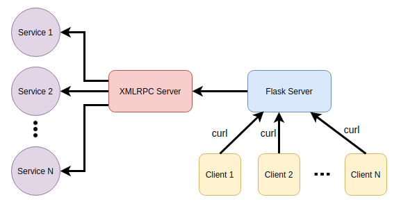

# Service Oriented Programming in Python


In this repository we explore the service-oriented programming using python. I tried to
implement it in a way that the services can be added/removed on the fly using the services_config.yml

## How to run?
Run the server:
```
python xmlrpc_server.py
```

Run the client:
```
python xmlrpc_client.py
```


## Use Flask as server
We also included the flask as a proxy to access the services without direct interactions with the XMLRPC and through 
curl. For this run the server:
```
python xmlrpc_server.py
```
Run the flask:
```
python flask_server.py
```

Send the curl commands:

```
curl --header "Content-Type: application/json" --request POST --data '{"text":"This is a good game"}' http://localhost:5000/api/ask_gpt
```
```
curl --header "Content-Type: application/json" --request POST --data '{"text":"Einstein"}' http://localhost:5000/api/ask_wikipedia
```
```
curl --header "Content-Type: application/json" --request POST --data '{"text":"London,GB"}' http://localhost:5000/api/ask_weather
```
